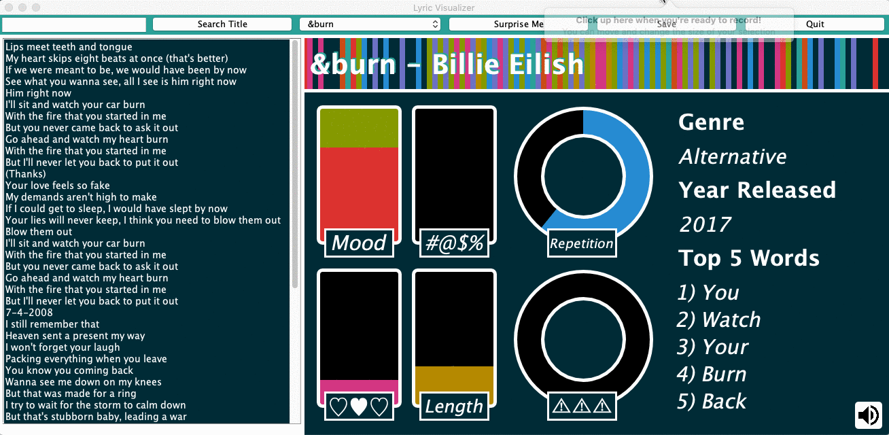

# Lyric Visualizer

&nbsp; A desktop application that creates charts and diagrams based on lyrics
<br />



## Usage
### Adding Music
All songs with music are denoted by a **(♬)** at the end of the song title

1. Download the song file
2. Convert file to **.wav** if it is not in that format already ([Music.io](https://www.media.io/convert/mp3-to-wav.html) is a great tool for this)
3. Rename the file to be the song title in `CamelCase.wav` (i.e. `SingleLadies.wav`)
4. Upload the file to the [music folder](res/music)

### Adding Lyrics
1. Open the [lyric document](res/allLyrics)
2. Add your song anywhere in the document formatted as written below
```
*****
Song Title
Artist
Genre (Alternative, Electronic, Indie, Metal, Pop, R&B, Rap, Rock)
Year Released
-----
Lyrics
*****
```
3. Open the [song title document](res/songTitles)
4. Write the song title anywhere in the document on a new line followed by a space and a `♬` character

## Stack
- Written in Java
- GUI design in Java Swing

## Acknowledgments
- Lyrics from [AZLyrics](http://www.azlyrics.com)
- Music from [Filmstro](https://filmstro.com/music)

